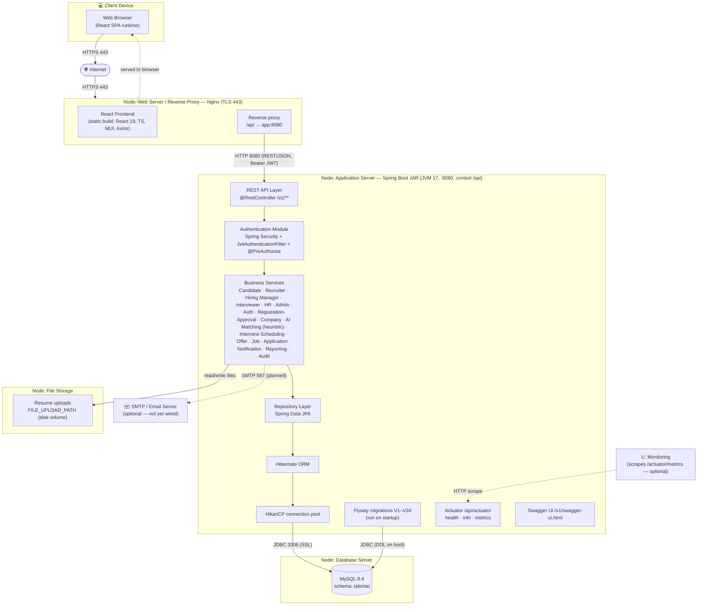
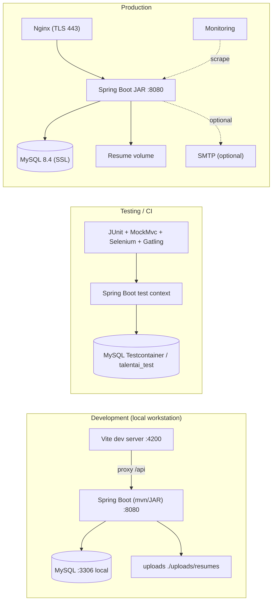
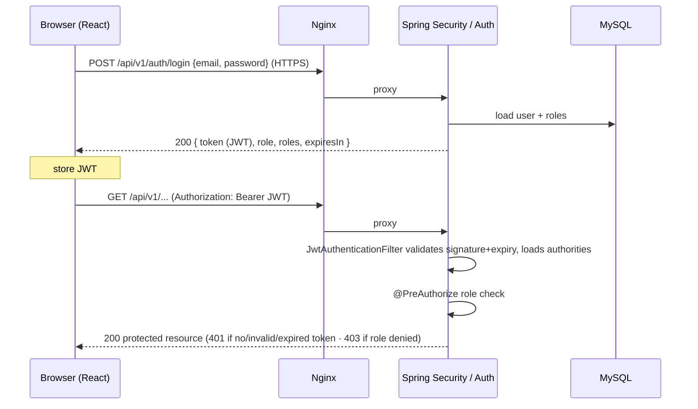
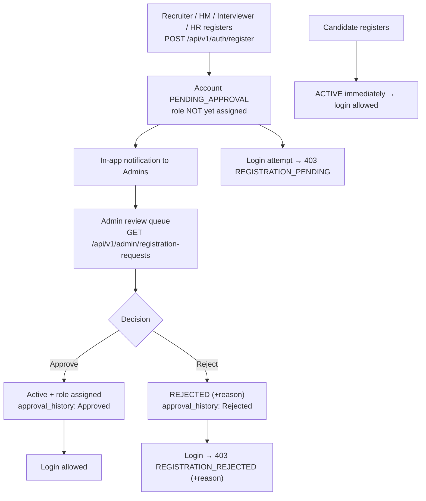
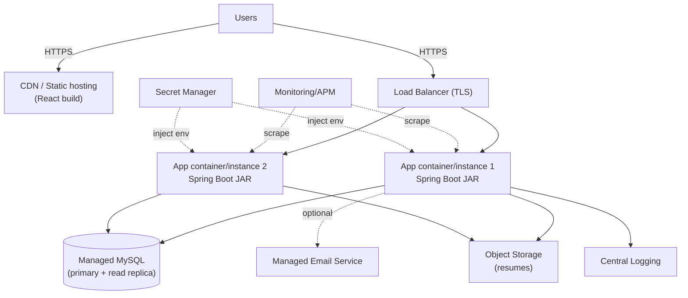
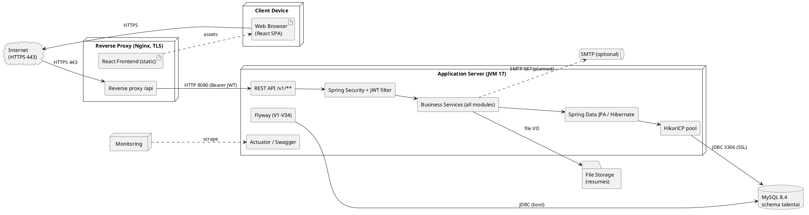
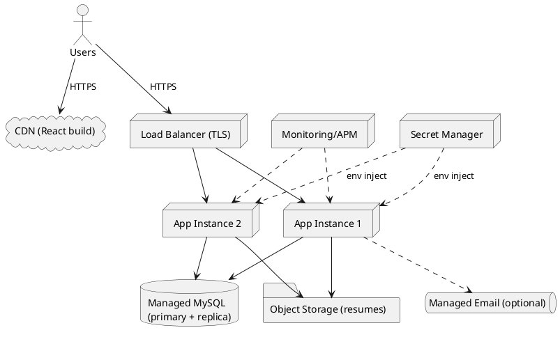

# TalentAI — Deployment Architecture

UML/deployment view of the **as-built** TalentAI platform. It reflects the real implementation, not a
conceptual model.

**Accuracy notes (as-built vs. brief):**
- Runtime is **Java 17** (`pom.xml` `<java.version>17</java.version>`), Spring Boot **3.3.5**, MySQL **8.4**.
- The backend serves under context path **`/api`**, controllers under **`/v1/**`**, default port **8080**.
- **Notifications are in-app** (rows in the `notification` table); an SMTP server is *configured via env vars but
  not yet wired* (no mail starter on the classpath). SMTP is therefore shown as an **optional/planned** node.
- **AI Matching is an in-process deterministic heuristic** (no external LLM call); `AI_PROVIDER_BASE_URL` /
  `OPENAI_API_KEY` exist as env vars but are currently unused.
- **Nginx reverse proxy** is used in Production to terminate TLS and serve the React build; in Development the
  frontend runs on the **Vite dev server (4200)** and calls the backend directly.

---

## 1 & 2. UML Deployment Diagram / Production Deployment Architecture (Mermaid)



---

## 3. Component Placement

| Component | Deployed on node | Artifact |
|---|---|---|
| React SPA (Candidate/Recruiter/HM/Interviewer/HR/Admin UIs) | Nginx (static) / browser runtime | `dist/` static bundle |
| REST API, Security/JWT, all business services, JPA repos, Hibernate, Hikari, Flyway, Actuator, Swagger | Spring Boot Application Server | `talentai-backend-*.jar` |
| Relational data (users, roles, candidates, jobs, applications, interviews, offers, notifications, audit, registration requests, company, approval history) | Database Server | MySQL schema `talentai` |
| Resume files | File Storage node | Disk volume at `FILE_UPLOAD_PATH` |
| In-app notifications | Database Server | `notification` table |
| Email delivery | SMTP node (optional/planned) | — |
| Metrics/health | Application Server (exposed), Monitoring node (scrapes) | Actuator endpoints |

---

## 4. Communication Protocols

| From → To | Protocol / Port | Notes |
|---|---|---|
| Browser → Nginx | HTTPS / 443 | TLS terminated at proxy |
| Nginx → React static | HTTPS | SPA assets |
| Nginx → Spring Boot | HTTP / 8080 | `location /api` reverse proxy (internal network) |
| React (Axios) → REST API | HTTPS REST / JSON | `Authorization: Bearer <JWT>` on protected calls |
| Repository → MySQL | JDBC / 3306 | via HikariCP, `useSSL` per env |
| Flyway → MySQL | JDBC / 3306 | schema migrate + validate on boot |
| Services → File storage | Filesystem I/O | resume read/write |
| Services → SMTP | SMTP+STARTTLS / 587 | optional/planned |
| Monitoring → Actuator | HTTP | `/api/actuator/metrics`, `/health` |

---

## 5. Deployment Explanation

The platform is a **two-tier deployable** (SPA + stateless API) over a relational store. In **Production**,
**Nginx** terminates TLS, serves the compiled React bundle, and reverse-proxies `/api/**` to the Spring Boot
JAR so the browser sees a single origin (no CORS needed in prod). The **Spring Boot** process is a stateless
executable JAR: on startup **Flyway** brings the MySQL schema to V34 and Hibernate validates the entity mapping
(`ddl-auto: validate` — the app never alters schema). Requests pass through the **JwtAuthenticationFilter**
(stateless bearer tokens), then `@PreAuthorize` role checks, into the **business services** (all TalentAI
modules), through **Spring Data JPA / Hibernate**, and out via the **HikariCP** pool over JDBC to **MySQL**.
Resume files live outside the DB on a **file-storage volume**; notifications are persisted **in-app** in MySQL.
Because the API holds no session state, it scales horizontally behind a proxy/load balancer.

---

## 6. Node Description

| Node | Role | Runtime |
|---|---|---|
| Client Device / Browser | Runs the React SPA, stores JWT (in-memory/localStorage) | Any modern browser |
| Nginx (reverse proxy) | TLS termination, static hosting, `/api` proxy, gzip | Nginx |
| Application Server | Hosts the Spring Boot JAR: REST, security, services, ORM, migrations | JVM 17 |
| Database Server | Persistent relational store + connection pooling target | MySQL 8.4 |
| File Storage | Resume upload persistence | Disk volume / mounted path |
| SMTP Server | Outbound transactional email (optional/planned) | SMTP relay |
| Monitoring | Health/metrics collection & dashboards | Actuator + Prometheus/Grafana (optional) |

---

## 7. Technology Mapping

| Layer | Technology | Node |
|---|---|---|
| Presentation | React 19, TypeScript, Material UI, Axios, Vite build | Nginx / Browser |
| API | Spring Web (REST), springdoc-openapi (Swagger) | App Server |
| Security | Spring Security, JWT (jjwt HS-family), method security | App Server |
| Business | Spring `@Service` modules (all TalentAI domains) | App Server |
| Persistence | Spring Data JPA, Hibernate, HikariCP | App Server → DB |
| Migration | Flyway (V1–V34) | App Server → DB |
| Database | MySQL 8.4 (InnoDB, utf8mb4) | DB Server |
| Files | Java NIO filesystem storage | File Storage |
| Observability | Spring Boot Actuator | App Server |
| Build/CI | Maven, Git, GitHub (+ Actions) | Dev/CI |

---

## 8. Environment Variable Mapping (no hard-coded values)

Configuration is entirely env-driven (`application.yml` reads `${VAR}`); only `application-{profile}.yml` differs.

| Variable | Dev | Test | Production |
|---|---|---|---|
| `SPRING_PROFILES_ACTIVE` | `dev` | `test` | `prod` |
| `DB_HOST` / `DB_PORT` / `DB_NAME` | `localhost` / `3306` / `talentai` | Testcontainers (dynamic) or `talentai_test` | managed DB host / `3306` / `talentai` |
| `DB_USERNAME` / `DB_PASSWORD` | dev creds (`.env`, gitignored) | container creds | **secret manager** |
| `DB_USE_SSL` | `false` | `false` | `true` |
| `DB_POOL_MAX_SIZE` / `DB_POOL_MIN_IDLE` | `10` / `2` | small | tuned (e.g. `20`+) |
| `JWT_SECRET` | dev-only value | test value | **secret manager**, ≥256-bit |
| `JWT_EXPIRATION_MS` / `JWT_REFRESH_EXPIRATION_MS` | `3600000` / `86400000` | short | policy-driven |
| `FILE_UPLOAD_PATH` / `FILE_MAX_SIZE_MB` | `./uploads/resumes` / `10` | temp dir | persistent volume / object mount |
| `MAIL_HOST` / `MAIL_PORT` / `MAIL_USERNAME` / `MAIL_PASSWORD` | unset | unset | SMTP relay + secret (when enabled) |
| `AI_PROVIDER_BASE_URL` / `OPENAI_API_KEY` / `AI_MODEL` | unset (heuristic) | unset | set only if external AI is enabled |
| `CORS_ALLOWED_ORIGINS` | `http://localhost:4200` | test origin | prod domain(s) |
| `SERVER_PORT` | `8080` | `8080` | `8080` (behind proxy) |
| `SWAGGER_UI_ENABLED` | `true` | `true` | `false` |
| `LOG_LEVEL` / `LOG_LEVEL_APP` | `INFO` | `WARN`/`INFO` | `INFO`/`WARN` |
| `ACTUATOR_HEALTH_DETAILS` | `when-authorized` | — | `when-authorized`/`never` |

Secrets are never committed: dev uses a gitignored `Backend/.env`; prod uses the platform's secret manager / injected env.

---

## 9. Deployment Environments (Mermaid)



**Config source per env:** Dev → `Backend/.env` (gitignored). Test → `@DynamicPropertySource` (Testcontainers) or
`IT_JDBC_URL` for a local MySQL; `application-test.yml`. Prod → injected environment / secret manager;
`application-prod.yml`.

---

## 10. JWT Authentication Flow (Mermaid)



---

## 11. Registration Approval Flow (Mermaid)



---

## 12. Optional Cloud Deployment (Mermaid)



Cloud mapping (provider-neutral): Load Balancer (ALB/App Gateway/GCLB) · App tier (ECS/EKS/App Service/Cloud Run,
2+ stateless instances) · Managed MySQL (RDS/Cloud SQL/Azure MySQL) · Object Storage (S3/Blob/GCS) for resumes ·
Managed Email (SES/SendGrid) · Monitoring (CloudWatch/Prometheus+Grafana/App Insights) · Secret Manager for
`JWT_SECRET`, DB creds, SMTP creds.

---

## 13. PlantUML — Production Deployment



### PlantUML — Optional Cloud Deployment



---

## 14. ASCII Deployment Diagram (documentation-friendly)

```text
        ┌───────────────────────┐
        │      Client Device      │
        │   Web Browser (React)   │
        └───────────┬─────────────┘
                    │ HTTPS 443
                    ▼
             ~ ~ ~ Internet ~ ~ ~
                    │ HTTPS 443
                    ▼
   ┌────────────────────────────────────────────┐
   │      Reverse Proxy — Nginx (TLS)             │
   │   • React static build (SPA)                 │
   │   • /api  ──►  reverse proxy to app:8080     │
   └───────────────────────┬──────────────────────┘
                            │ HTTP 8080  (REST/JSON, Bearer JWT)
                            ▼
   ┌────────────────────────────────────────────────────────────┐
   │        Application Server — Spring Boot JAR (JVM 17)          │
   │  REST /v1/**                                                 │
   │     └► Spring Security + JwtAuthenticationFilter + @PreAuth   │
   │           └► Business Services                                │
   │              (Candidate·Recruiter·HiringManager·Interviewer· │
   │               HR·Admin·Auth·Registration-Approval·AI Match·  │
   │               Interview·Offer·Job·Application·Notification·  │
   │               Reporting·Audit)                               │
   │                 └► Spring Data JPA ─► Hibernate ─► HikariCP   │
   │  Flyway (V1–V34, on boot)     Actuator /health,/metrics      │
   └───────┬───────────────────────────┬───────────────┬──────────┘
           │ JDBC 3306 (SSL)            │ file I/O      │ SMTP 587 (optional)
           ▼                            ▼               ▼
   ┌───────────────┐         ┌────────────────────┐   ┌──────────────┐
   │  MySQL 8.4     │         │  File Storage       │   │ SMTP / Email │
   │  schema        │         │  resumes            │   │ (planned)    │
   │  talentai      │         │  FILE_UPLOAD_PATH   │   └──────────────┘
   └───────────────┘         └────────────────────┘
```

---

## 15. Security Considerations
- **TLS everywhere in prod** — HTTPS at the proxy; browser↔proxy encrypted; app reachable only on the internal network.
- **Stateless JWT** — signed bearer tokens (HS, `JWT_SECRET` from secret manager); no server sessions. Expired/invalid → `401`; missing → `401` via the JWT entry point.
- **Spring Security + `@PreAuthorize`** — role-based method authorization (e.g. approval endpoints require `SYSTEM_ADMIN`/`HR_ADMIN`).
- **Registration approval gate** — non-Candidate roles cannot log in until Admin approval (`403 REGISTRATION_PENDING/REJECTED`); System Admin is not self-registerable (data-driven + server-validated).
- **Least privilege DB user** — app connects with a scoped MySQL user (not root); `useSSL=true` in prod.
- **Secrets** — never in git; dev `.env` gitignored, prod via secret manager. CORS restricted to known origins; Swagger UI disabled in prod.
- **Auditing** — significant events (register/approve/reject/role-assign/activation/login) written to `audit_log`.

## 16. Scalability Recommendations
- **Scale the API horizontally** — it's stateless; run N instances behind the LB/proxy. JWT means no sticky sessions.
- **Static/CDN** — serve the React build from CDN/object storage to offload the app tier.
- **Database** — tune HikariCP (`DB_POOL_MAX_SIZE`) to instance count; add a **read replica** for reporting/dashboards; the existing indexes support the hot paths.
- **Move resumes to object storage** (S3/Blob/GCS) instead of a local volume so any instance can serve them and storage scales independently.
- **Externalize notifications/email** — introduce a managed email service and/or a queue for async delivery when SMTP is enabled.
- **Observability** — scrape Actuator metrics into Prometheus/Grafana or an APM; alert on latency/error-rate/DB-pool saturation.
- **CI/CD** — the GitHub Actions workflow already builds/tests; extend it to build the JAR + container image and deploy per environment.
```
