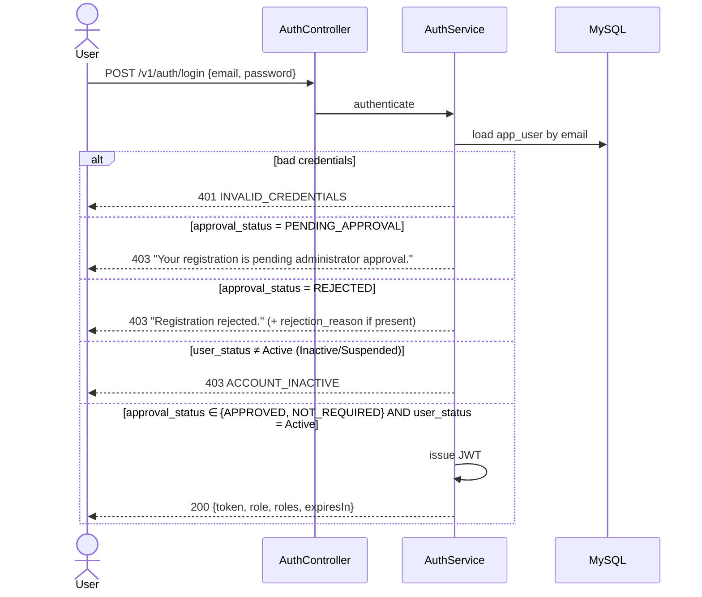
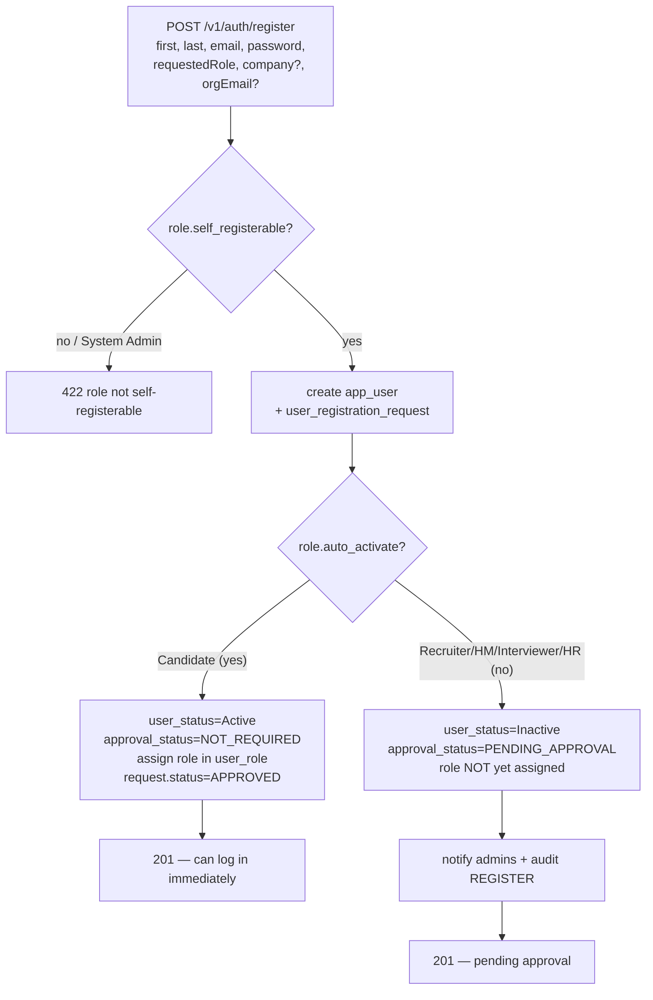
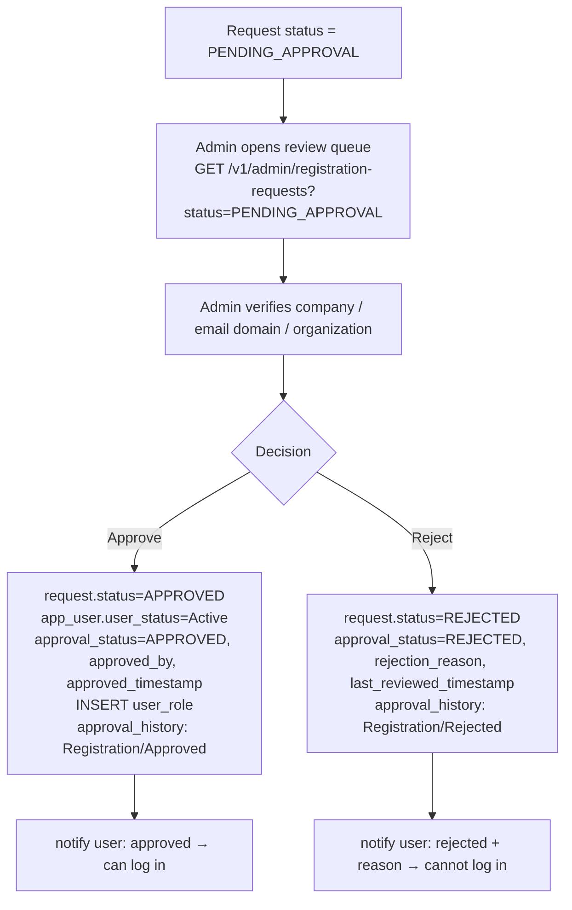

# TalentAI — Self-Registration & Admin-Approval Design

**Change:** allow all business roles (not just Candidates) to self-register from one page, with an
admin-approval gate for non-Candidate roles. Nothing existing is removed — this extends the current
`app_user` / `role` / `user_role` model and reuses the existing `approval_history` and `audit_log`
infrastructure. Target: 3NF, Spring Boot 3 + MySQL 8, Flyway.

> Grounded in the current schema: `app_user` (V1), `role` (V2), `user_role` (V4),
> `approval_history` (V20, polymorphic), `audit_log` (V23), roles seeded in V25. New Flyway
> migrations start at **V30** (highest existing is V29).

---

## 0. Summary of the two flows

- **Candidate** → registers → account **ACTIVE immediately** → can log in.
- **Recruiter / Hiring Manager / Interviewer / HR Admin** → registers → **PENDING_APPROVAL** → admin verifies company/email/organization → **Approve → ACTIVE** (user notified, can log in) or **Reject → REJECTED** (cannot log in; reason shown).
- **System Admin** → **never** offered on the public page; created manually / by controlled admin process.

The registration form shows **"Register as"** listing only roles flagged `self_registerable = TRUE`
(Candidate, Recruiter, Hiring Manager, Interviewer, HR Admin). System Admin is excluded both in the UI
**and** re-validated server-side, so a crafted request cannot self-provision an admin.

---

## 1. Updated ER Diagram

```mermaid
erDiagram
    APP_USER ||--o{ USER_ROLE : "has"
    ROLE ||--o{ USER_ROLE : "assigned in"
    APP_USER ||--o| USER_REGISTRATION_REQUEST : "submits (self-reg)"
    ROLE ||--o{ USER_REGISTRATION_REQUEST : "requested as"
    COMPANY ||--o{ USER_REGISTRATION_REQUEST : "claimed by"
    COMPANY ||--o{ APP_USER : "employs (optional)"
    APP_USER ||--o{ APPROVAL_HISTORY : "decided by (approver)"
    USER_REGISTRATION_REQUEST ||--o{ APPROVAL_HISTORY : "reviewed via (entity_type='Registration')"
    APP_USER ||--o{ AUDIT_LOG : "acts in"

    APP_USER {
        BIGINT user_id PK
        VARCHAR email UK
        VARCHAR password_hash
        VARCHAR user_status "Active|Inactive|Suspended"
        VARCHAR approval_status "NOT_REQUIRED|PENDING_APPROVAL|APPROVED|REJECTED (NEW)"
        INT requested_role_id FK "role requested at signup (NEW)"
        BIGINT company_id FK "nullable (NEW)"
        VARCHAR organization_email "NEW"
        VARCHAR verification_status "NEW"
        BIGINT approved_by FK "-> app_user (NEW)"
        DATETIME approved_timestamp "NEW"
        VARCHAR rejection_reason "NEW"
        DATETIME last_reviewed_timestamp "NEW"
        BIGINT created_by FK
    }
    ROLE {
        INT role_id PK
        VARCHAR role_name UK
        BOOLEAN self_registerable "NEW"
        BOOLEAN requires_approval "NEW"
        BOOLEAN auto_activate "NEW"
    }
    USER_ROLE {
        BIGINT user_role_id PK
        BIGINT user_id FK
        INT role_id FK
    }
    COMPANY {
        BIGINT company_id PK
        VARCHAR company_name UK
        VARCHAR email_domain
        VARCHAR verification_status "Pending|Verified|Rejected"
        BIGINT verified_by FK
        DATETIME verified_at
    }
    USER_REGISTRATION_REQUEST {
        BIGINT request_id PK
        BIGINT user_id FK UK
        INT requested_role_id FK
        BIGINT company_id FK "nullable"
        VARCHAR organization_email
        VARCHAR status "PENDING_APPROVAL|APPROVED|REJECTED"
        DATETIME submitted_at
        BIGINT reviewed_by FK "nullable"
        DATETIME reviewed_at "nullable"
        VARCHAR rejection_reason "nullable"
    }
    APPROVAL_HISTORY {
        BIGINT approval_id PK
        VARCHAR entity_type "Job|Offer|Registration (EXTENDED)"
        BIGINT entity_id "= request_id when Registration"
        VARCHAR decision "Approved|Rejected|Pending"
        BIGINT approver_id FK
        DATETIME action_date
    }
    AUDIT_LOG {
        BIGINT audit_id PK
        BIGINT user_id FK
        VARCHAR action "REGISTER|APPROVE|REJECT|LOGIN..."
        VARCHAR entity_type
        BIGINT entity_id
    }
```

**Cardinality / optionality**
- `APP_USER 1—0..1 USER_REGISTRATION_REQUEST` — only *self-registered* users have a request; admin-created users (System Admin) have none (optional).
- `ROLE 1—0..* USER_REGISTRATION_REQUEST` — a role is the *requested* role of many requests (mandatory FK on the request).
- `COMPANY 1—0..* USER_REGISTRATION_REQUEST` and `COMPANY 1—0..* APP_USER` — company is **optional** (Candidates have none).
- `USER_REGISTRATION_REQUEST 1—0..* APPROVAL_HISTORY` — each request accrues one or more decision rows (reuse of the polymorphic table); business rule limits it to **one terminal** decision.
- `APP_USER 1—0..* APPROVAL_HISTORY` via `approver_id` — an admin decides many requests.

---

## 2. Logical Database Design

| Entity | Key attributes | Keys / constraints |
|---|---|---|
| **AppUser** (modified) | user_id, email, password_hash, first/last_name, user_status, **approval_status**, **requested_role_id**, **company_id**, **organization_email**, **verification_status**, **approved_by**, **approved_timestamp**, **rejection_reason**, **last_reviewed_timestamp** | PK user_id · UK email · FK requested_role_id→Role · FK company_id→Company · FK approved_by→AppUser · CHECK approval_status ∈ {NOT_REQUIRED, PENDING_APPROVAL, APPROVED, REJECTED} |
| **Role** (modified) | role_id, role_name, **self_registerable**, **requires_approval**, **auto_activate** | PK role_id · UK role_name · business rule: `auto_activate ⇒ NOT requires_approval` |
| **UserRole** (unchanged) | user_role_id, user_id, role_id | PK · UK(user_id, role_id) · FKs |
| **Company** (new) | company_id, company_name, email_domain, verification_status, verified_by, verified_at | PK · UK company_name · CHECK verification_status ∈ {Pending, Verified, Rejected} · FK verified_by→AppUser |
| **UserRegistrationRequest** (new) | request_id, user_id, requested_role_id, company_id, organization_email, status, submitted_at, reviewed_by, reviewed_at, rejection_reason | PK · **UK user_id** (one request per user) · FKs · CHECK status ∈ {PENDING_APPROVAL, APPROVED, REJECTED} |
| **ApprovalHistory** (extended) | approval_id, entity_type, entity_id, decision, approver_id, action_date, comments | CHECK entity_type ∈ {Job, Offer, **Registration**} · FK approver_id→AppUser |
| **AuditLog** (reused) | audit_id, user_id, action, entity_type, entity_id, … | reused for REGISTER / APPROVE / REJECT events |

**Business constraints (logical):** login requires `user_status = Active` **and** `approval_status ∈ {APPROVED, NOT_REQUIRED}`; a request has exactly one terminal decision; `organization_email` domain must equal `company.email_domain` when the company is configured with one.

---

## 3. Physical Database Design (MySQL 8, Flyway V30–V34)

### V30 — Role self-registration policy (data-driven; drives the form + approval gate)
```sql
ALTER TABLE role
    ADD COLUMN self_registerable BOOLEAN NOT NULL DEFAULT FALSE AFTER description,
    ADD COLUMN requires_approval BOOLEAN NOT NULL DEFAULT TRUE  AFTER self_registerable,
    ADD COLUMN auto_activate     BOOLEAN NOT NULL DEFAULT FALSE AFTER requires_approval;

UPDATE role SET self_registerable=TRUE,  requires_approval=FALSE, auto_activate=TRUE
    WHERE role_name = 'Candidate';
UPDATE role SET self_registerable=TRUE,  requires_approval=TRUE,  auto_activate=FALSE
    WHERE role_name IN ('Recruiter','Hiring Manager','Interviewer','HR Admin');
UPDATE role SET self_registerable=FALSE, requires_approval=TRUE,  auto_activate=FALSE
    WHERE role_name = 'System Admin';
```

### V31 — Company (organization verification)
```sql
CREATE TABLE company (
    company_id          BIGINT AUTO_INCREMENT PRIMARY KEY,
    company_name        VARCHAR(150) NOT NULL,
    email_domain        VARCHAR(150) NULL,               -- e.g. 'acme.com'
    verification_status VARCHAR(20)  NOT NULL DEFAULT 'Pending',
    verified_by         BIGINT       NULL,
    verified_at         DATETIME     NULL,
    created_date        DATETIME     NOT NULL DEFAULT CURRENT_TIMESTAMP,
    created_by          BIGINT       NULL,
    modified_date       DATETIME     NULL ON UPDATE CURRENT_TIMESTAMP,
    modified_by         BIGINT       NULL,
    is_active           BOOLEAN      NOT NULL DEFAULT TRUE,
    CONSTRAINT uq_company_name UNIQUE (company_name),
    CONSTRAINT ck_company_verification CHECK (verification_status IN ('Pending','Verified','Rejected'))
) ENGINE=InnoDB DEFAULT CHARSET=utf8mb4 COLLATE=utf8mb4_unicode_ci;

CREATE INDEX ix_company_email_domain ON company (email_domain);
ALTER TABLE company ADD CONSTRAINT fk_company_verified_by FOREIGN KEY (verified_by) REFERENCES app_user(user_id);
ALTER TABLE company ADD CONSTRAINT fk_company_created_by  FOREIGN KEY (created_by)  REFERENCES app_user(user_id);
ALTER TABLE company ADD CONSTRAINT fk_company_modified_by FOREIGN KEY (modified_by) REFERENCES app_user(user_id);
```

### V32 — Extend `app_user` with the current approval snapshot
```sql
ALTER TABLE app_user
    ADD COLUMN approval_status         VARCHAR(20)  NOT NULL DEFAULT 'APPROVED' AFTER user_status,
    ADD COLUMN requested_role_id       INT          NULL      AFTER approval_status,
    ADD COLUMN company_id              BIGINT       NULL      AFTER requested_role_id,
    ADD COLUMN organization_email      VARCHAR(150) NULL      AFTER company_id,
    ADD COLUMN verification_status     VARCHAR(20)  NOT NULL DEFAULT 'NotRequired' AFTER organization_email,
    ADD COLUMN approved_by             BIGINT       NULL      AFTER verification_status,
    ADD COLUMN approved_timestamp      DATETIME     NULL      AFTER approved_by,
    ADD COLUMN rejection_reason        VARCHAR(500) NULL      AFTER approved_timestamp,
    ADD COLUMN last_reviewed_timestamp DATETIME     NULL      AFTER rejection_reason,
    ADD CONSTRAINT ck_user_approval_status
        CHECK (approval_status IN ('NOT_REQUIRED','PENDING_APPROVAL','APPROVED','REJECTED')),
    ADD CONSTRAINT ck_user_verification_status
        CHECK (verification_status IN ('NotRequired','Pending','Verified','Failed'));

-- Existing rows: default 'APPROVED' keeps every current account loginable (no regression).
-- Candidates registering after this change are written as 'NOT_REQUIRED'.
ALTER TABLE app_user ADD CONSTRAINT fk_user_requested_role FOREIGN KEY (requested_role_id) REFERENCES role(role_id);
ALTER TABLE app_user ADD CONSTRAINT fk_user_company        FOREIGN KEY (company_id)        REFERENCES company(company_id);
ALTER TABLE app_user ADD CONSTRAINT fk_user_approved_by    FOREIGN KEY (approved_by)       REFERENCES app_user(user_id);
CREATE INDEX ix_user_approval_status ON app_user (approval_status);
```

### V33 — Registration request (the reviewable submission)
```sql
CREATE TABLE user_registration_request (
    request_id         BIGINT AUTO_INCREMENT PRIMARY KEY,
    user_id            BIGINT       NOT NULL,
    requested_role_id  INT          NOT NULL,
    company_id         BIGINT       NULL,
    organization_email VARCHAR(150) NULL,
    status             VARCHAR(20)  NOT NULL DEFAULT 'PENDING_APPROVAL',
    submitted_at       DATETIME     NOT NULL DEFAULT CURRENT_TIMESTAMP,
    reviewed_by        BIGINT       NULL,
    reviewed_at        DATETIME     NULL,
    rejection_reason   VARCHAR(500) NULL,
    created_date       DATETIME     NOT NULL DEFAULT CURRENT_TIMESTAMP,
    created_by         BIGINT       NULL,
    modified_date      DATETIME     NULL ON UPDATE CURRENT_TIMESTAMP,
    modified_by        BIGINT       NULL,
    is_active          BOOLEAN      NOT NULL DEFAULT TRUE,
    CONSTRAINT uq_reg_request_user UNIQUE (user_id),
    CONSTRAINT ck_reg_request_status CHECK (status IN ('PENDING_APPROVAL','APPROVED','REJECTED')),
    CONSTRAINT fk_reg_request_user      FOREIGN KEY (user_id)           REFERENCES app_user(user_id) ON DELETE CASCADE,
    CONSTRAINT fk_reg_request_role      FOREIGN KEY (requested_role_id) REFERENCES role(role_id),
    CONSTRAINT fk_reg_request_company   FOREIGN KEY (company_id)        REFERENCES company(company_id),
    CONSTRAINT fk_reg_request_reviewer  FOREIGN KEY (reviewed_by)       REFERENCES app_user(user_id)
) ENGINE=InnoDB DEFAULT CHARSET=utf8mb4 COLLATE=utf8mb4_unicode_ci;

CREATE INDEX ix_reg_request_status ON user_registration_request (status);
```

### V34 — Reuse the existing approval-history table for registrations
```sql
ALTER TABLE approval_history DROP CHECK ck_approval_history_entity_type;
ALTER TABLE approval_history ADD CONSTRAINT ck_approval_history_entity_type
    CHECK (entity_type IN ('Job','Offer','Registration'));
-- For a registration decision: entity_type='Registration', entity_id = request_id.
```

**Physical conventions applied:** `BIGINT AUTO_INCREMENT` surrogate PKs; `utf8mb4`; `DATETIME DEFAULT CURRENT_TIMESTAMP` / `ON UPDATE`; named `CHECK`/`UNIQUE`/`FK` constraints; indexes on the login-path (`app_user.approval_status`) and review-queue (`request.status`, `company.email_domain`) columns; `ON DELETE CASCADE` only where the child (request) is meaningless without its user — never on audit/history (those are retained). Nullability follows optionality (candidate has no company/org email).

---

## 4. Updated Entity Relationships

| From | To | Type | Mandatory? | Notes |
|---|---|---|---|---|
| app_user | user_role | 1 : 0..* | opt | existing |
| role | user_role | 1 : 0..* | opt | existing |
| app_user | user_registration_request | 1 : 0..1 | opt | only self-registered users |
| role | user_registration_request | 1 : 0..* | **req** (requested_role_id) | which role was requested |
| company | user_registration_request | 1 : 0..* | opt | claimed employer |
| company | app_user | 1 : 0..* | opt | user's verified employer |
| app_user (approver) | approval_history | 1 : 0..* | req on row | admin decisions |
| user_registration_request | approval_history | 1 : 0..* | via entity_id | `entity_type='Registration'` |
| app_user | audit_log | 1 : 0..* | opt | REGISTER/APPROVE/REJECT |

---

## 5. Table Structures — Modified & New

**Modified `app_user`** — added: `approval_status`, `requested_role_id`, `company_id`, `organization_email`,
`verification_status`, `approved_by`, `approved_timestamp`, `rejection_reason`, `last_reviewed_timestamp`.
(`user_status` unchanged — it stays the account state; `approval_status` is the orthogonal approval dimension.)

**Modified `role`** — added: `self_registerable`, `requires_approval`, `auto_activate`.

**Modified `approval_history`** — `entity_type` CHECK now includes `Registration`.

**New `company`**, **New `user_registration_request`** — full DDL in §3.

> **On the requested field `registration_status`:** it is *not* added as a separate column — it would
> duplicate the fact already carried by `approval_status` + `user_status` (a 3NF violation: two columns
> encoding one truth). The requested `created_by` already exists on `app_user`. `approved_date` and
> `approved_by` map to `approved_timestamp` / `approved_by`. This keeps the login read (`app_user`) lean
> while full history lives in `user_registration_request` + `approval_history`.

---

## 6. Updated Authentication (Login) Flow



Login is allowed **iff** `user_status='Active' AND approval_status ∈ {'APPROVED','NOT_REQUIRED'} AND is_active=TRUE`.
The status checks run **before** returning a token so each denial gets its specific, safe message.

---

## 7. Updated Registration Flow



Server-side guard: `requestedRole` must resolve to a role with `self_registerable=TRUE`; System Admin is
rejected even if the client forges it.

---

## 8. Updated Approval Workflow



New endpoints (Spring): `GET /v1/admin/registration-requests` (list/filter by status),
`PATCH /v1/admin/registration-requests/{id}/approve`, `PATCH …/{id}/reject {reason}` — all
`@PreAuthorize("hasAnyRole('SYSTEM_ADMIN','HR_ADMIN')")`. Approval is idempotent and allowed **once**
(guard: only a `PENDING_APPROVAL` request can transition).

---

## 9. Modified tables
1. **`app_user`** — +9 approval/verification columns, +3 FKs, +2 CHECKs, +1 index.
2. **`role`** — +3 policy flags (`self_registerable`, `requires_approval`, `auto_activate`) + seed values.
3. **`approval_history`** — `entity_type` CHECK extended to include `Registration`.

## 10. Newly added tables
1. **`company`** — organization + email-domain verification.
2. **`user_registration_request`** — the reviewable self-registration submission and its outcome.

_(No new table for audit — the existing `audit_log` (V23) is reused for REGISTER/APPROVE/REJECT. No new
"approval history" table — the existing polymorphic `approval_history` (V20) is reused.)_

---

## 11. Updated Business Rules

| # | Rule |
|---|---|
| BR-R1 | Only `user_status='Active'` **and** `approval_status ∈ {APPROVED, NOT_REQUIRED}` users may log in. |
| BR-R2 | Candidates are `auto_activate` → `Active` / `NOT_REQUIRED` on registration; can log in immediately. |
| BR-R3 | Recruiter, Hiring Manager, Interviewer, HR Admin self-register as `PENDING_APPROVAL`; cannot log in until approved. |
| BR-R4 | Only Admin roles (`SYSTEM_ADMIN`, `HR_ADMIN`) may approve/reject registrations. |
| BR-R5 | A registration request has exactly **one** terminal decision (only a `PENDING_APPROVAL` request may transition). |
| BR-R6 | Rejected users cannot log in; the stored `rejection_reason` is surfaced. |
| BR-R7 | `organization_email` domain must equal `company.email_domain` when the company has one configured. |
| BR-R8 | System Admin is **not** self-registerable (`self_registerable=FALSE`); created only via controlled admin process. |
| BR-R9 | The role assignment (`user_role`) for an approval-required role is created **only on approval**, never at signup. |

---

## 12. Design decisions & rationale

- **Orthogonal `approval_status` vs `user_status` (not a merged enum).** Approval is a *review* dimension; account state is an *operational* dimension (e.g., an APPROVED user can later be Suspended). Keeping them separate avoids an explosion of combined states and is 3NF-clean. *Security:* the login gate checks both explicitly. *Maintainability:* existing `user_status` code paths keep working.
- **Data-driven role policy flags instead of hard-coded role logic.** `self_registerable / requires_approval / auto_activate` on `role` let the registration form and the approval gate be driven by data. *Scalability:* adding "Company Administrator" later is a seed row, not a code change. *Security:* the "no self-registering System Admin" rule is enforced by data + a server check, not scattered `if`s.
- **Reuse `approval_history` (extend the CHECK) and `audit_log`.** The polymorphic approval table already models Job/Offer approvals; registration is the same shape. *Maintainability:* one approval/audit mechanism, one query surface, less code. *DRY.*
- **Dedicated `user_registration_request` table** rather than piling process history onto `app_user`. *Normalization:* the review lifecycle (submitted/reviewed/reason) depends on the *request*, not the user identity. *Scalability:* the admin review queue indexes `status` without touching the hot `app_user` table; the login path reads a single lean `app_user` row.
- **Snapshot columns on `app_user` (`approval_status`, `approved_by`, …).** The login path must decide in one row read — so the *current* decision is denormalized onto `app_user`, while the *full history* stays normalized in the request/approval tables. A deliberate, documented read-optimization, not accidental duplication.
- **`company` + `email_domain`** enables the "organization email matches company domain" verification and future SSO/domain-capture — *security* (curbs impersonation of an employer) and *scalability* (multi-tenant ready).
- **Role assigned only on approval.** A pending user holds no `user_role`, so even if a token were somehow minted, authorization grants nothing. *Defense in depth.*
- **No destructive changes / additive migrations (V30–V34), existing rows default to `APPROVED`.** Zero regression for current users; Flyway forward-only; compatible with `ddl-auto: validate`.

---

## Spring Boot impact (for implementation — not yet built)
- `RegisterRequest` gains `requestedRole` (+ optional `companyName`/`organizationEmail`); `AuthServiceImpl.register` branches on the role policy (auto-activate vs pending) and writes `user_registration_request`.
- `AuthServiceImpl.login` adds the `approval_status` checks with specific messages (or `UserPrincipal.isEnabled()` stays the coarse gate and the service adds the messaging).
- New `RegistrationAdminController` + service for list/approve/reject; new `Company`, `UserRegistrationRequest` entities + repositories; role policy flags on the `Role` entity.
- Frontend `RegisterPage` adds a **"Register as"** radio group populated from self-registerable roles; a pending state screen; and login shows the pending/rejected messages.
- New JUnit + integration + UI tests mirror the existing candidate suites for the new roles and the approval gate.
